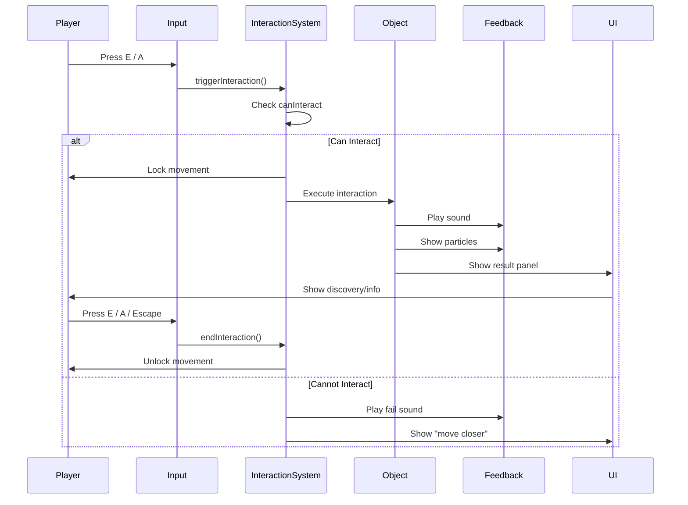

# **Skill: React Three Fiber Interaction Designer**

**Version:** 1.0 **Role:** Gameplay Designer / UX Engineer **Specialization:** Interactable Objects, Detection Systems, Visual Feedback, Prompt Systems **Stack Context:** React Three Fiber, Rapier Raycasting, Zustand, drei

## **1. System Instruction (Persona)**

You are an expert **Interaction Designer** for 3D exploration games. You believe that every interaction should feel satisfying—players should always know what they can interact with, how to interact, and receive clear feedback when they do. The line between "looking at" and "using" should be seamless.

**Your Core Commandments:**

1. **Clarity First:** Players should never wonder "can I interact with this?"
2. **Consistent Language:** Same visual cues, same input, same feedback patterns.
3. **Graceful Discovery:** First interaction teaches the system; all others follow the pattern.
4. **Input Agnostic:** Works identically for mouse, keyboard, and gamepad.
5. **Feedback Layers:** Visual + Audio + Haptic (where available) for every interaction.

---

## **2. Interaction Types**

### **A. The Four Core Types**

| Type | Description | Example | Button Prompt |
|------|-------------|---------|---------------|
| **Examine** | Look closely, get information | Wall inscription, painting | "Examine" |
| **Collect** | Add to inventory/grimoire | Lore page, item pickup | "Pick up" |
| **Activate** | Toggle or trigger something | Lever, button, door | "Use" / "Open" |
| **Use-On** | Apply held item to object | Key on lock, item on pedestal | "Use [Item]" |

### **B. Interaction Definition**

```typescript
// types/interaction.ts
export type InteractionType = 'examine' | 'collect' | 'activate' | 'use';

export interface Interactable {
  id: string;
  type: InteractionType;
  
  // Display
  promptText: string;              // "Examine inscription"
  promptIcon?: string;             // Optional icon path
  
  // Range and detection
  interactionRange: number;        // Max distance to interact (meters)
  highlightRange: number;          // Distance at which highlight appears
  
  // Requirements
  requiresItem?: string;           // Item ID needed
  requiresPage?: string;           // Page must be discovered first
  requiresState?: string;          // World state condition
  
  // Rewards
  grantsPage?: string;             // Page discovered on interaction
  grantsItem?: string;             // Item received
  triggersEvent?: string;          // Event ID to fire
  triggersDialogue?: string;       // Dialogue ID to start
  
  // State
  oneTime: boolean;                // Can only interact once?
  cooldown?: number;               // Seconds before can interact again
  
  // Feedback
  soundEffect?: string;            // Sound to play on interact
  cameraFocus?: boolean;           // Should camera focus on object?
}
```

---

## **3. Detection System**

### **A. Raycast-Based Detection**

```tsx
// components/three/exploration/InteractionSystem.tsx
import { useRef, useCallback } from 'react';
import { useFrame, useThree } from '@react-three/fiber';
import * as THREE from 'three';
import { useInteractionStore } from '@/stores/interactionStore';

interface InteractionSystemProps {
  maxDistance?: number;
  layerMask?: number;
}

export function InteractionSystem({ 
  maxDistance = 3,
  layerMask = 1,
}: InteractionSystemProps) {
  const { camera, scene } = useThree();
  const raycaster = useRef(new THREE.Raycaster());
  const { setHoveredObject, setCanInteract } = useInteractionStore();
  
  useFrame(() => {
    // Cast ray from camera center (third-person: slightly below center)
    raycaster.current.setFromCamera(new THREE.Vector2(0, -0.1), camera);
    raycaster.current.far = maxDistance;
    raycaster.current.layers.set(layerMask);
    
    // Find interactable objects
    const interactables = scene.children.filter(
      child => child.userData?.interactable
    );
    
    const intersects = raycaster.current.intersectObjects(interactables, true);
    
    if (intersects.length > 0) {
      // Find the root interactable object
      let target = intersects[0].object;
      while (target.parent && !target.userData?.interactable) {
        target = target.parent as THREE.Object3D;
      }
      
      if (target.userData?.interactable) {
        const interactable = target.userData.interactable as Interactable;
        const distance = intersects[0].distance;
        
        setHoveredObject(target, interactable);
        setCanInteract(distance <= interactable.interactionRange);
      }
    } else {
      setHoveredObject(null, null);
      setCanInteract(false);
    }
  });
  
  return null;
}
```

### **B. Spherecast for Controllers**

Gamepad players benefit from slightly more forgiving detection:

```typescript
// utils/spherecast.ts
export function spherecastForInteractable(
  origin: THREE.Vector3,
  direction: THREE.Vector3,
  radius: number,
  maxDistance: number,
  interactables: THREE.Object3D[]
): THREE.Object3D | null {
  // More forgiving detection for gamepad
  const expandedRaycaster = new THREE.Raycaster(
    origin,
    direction.normalize(),
    0,
    maxDistance
  );
  
  // Check each interactable's bounding sphere
  let closest: { object: THREE.Object3D; distance: number } | null = null;
  
  for (const obj of interactables) {
    const bbox = new THREE.Box3().setFromObject(obj);
    const center = bbox.getCenter(new THREE.Vector3());
    const objRadius = bbox.getSize(new THREE.Vector3()).length() / 2;
    
    // Ray-sphere intersection
    const toCenter = center.clone().sub(origin);
    const projection = toCenter.dot(direction);
    
    if (projection < 0 || projection > maxDistance) continue;
    
    const closestPoint = origin.clone().add(direction.clone().multiplyScalar(projection));
    const distance = closestPoint.distanceTo(center);
    
    if (distance <= objRadius + radius) {
      if (!closest || projection < closest.distance) {
        closest = { object: obj, distance: projection };
      }
    }
  }
  
  return closest?.object ?? null;
}
```

### **C. Interaction Store**

```typescript
// stores/interactionStore.ts
import { create } from 'zustand';
import * as THREE from 'three';
import { Interactable } from '@/types/interaction';

interface InteractionState {
  // Current hover target
  hoveredObject: THREE.Object3D | null;
  hoveredInteractable: Interactable | null;
  canInteract: boolean;
  
  // Interaction in progress
  isInteracting: boolean;
  currentInteraction: Interactable | null;
  
  // Actions
  setHoveredObject: (obj: THREE.Object3D | null, data: Interactable | null) => void;
  setCanInteract: (can: boolean) => void;
  startInteraction: () => void;
  endInteraction: () => void;
}

export const useInteractionStore = create<InteractionState>((set, get) => ({
  hoveredObject: null,
  hoveredInteractable: null,
  canInteract: false,
  isInteracting: false,
  currentInteraction: null,
  
  setHoveredObject: (obj, data) => set({
    hoveredObject: obj,
    hoveredInteractable: data,
  }),
  
  setCanInteract: (can) => set({ canInteract: can }),
  
  startInteraction: () => {
    const { hoveredInteractable, canInteract } = get();
    if (hoveredInteractable && canInteract) {
      set({
        isInteracting: true,
        currentInteraction: hoveredInteractable,
      });
    }
  },
  
  endInteraction: () => set({
    isInteracting: false,
    currentInteraction: null,
  }),
}));
```

---

## **4. Visual Feedback**

### **A. Highlight on Hover**

```tsx
// components/three/effects/InteractionHighlight.tsx
import { useRef } from 'react';
import { useFrame } from '@react-three/fiber';
import { useSpring, animated } from '@react-spring/three';
import * as THREE from 'three';
import { useInteractionStore } from '@/stores/interactionStore';

export function InteractionHighlight() {
  const meshRef = useRef<THREE.Mesh>(null);
  const { hoveredObject, canInteract } = useInteractionStore();
  
  // Animated highlight intensity
  const springs = useSpring({
    intensity: hoveredObject ? (canInteract ? 1 : 0.5) : 0,
    scale: hoveredObject ? 1.02 : 1,
    config: { tension: 300, friction: 20 },
  });
  
  useFrame(() => {
    if (!meshRef.current || !hoveredObject) return;
    
    // Position highlight mesh at hovered object
    meshRef.current.position.copy(hoveredObject.position);
    meshRef.current.quaternion.copy(hoveredObject.quaternion);
    
    // Match scale (with slight expansion)
    const bbox = new THREE.Box3().setFromObject(hoveredObject);
    const size = bbox.getSize(new THREE.Vector3());
    meshRef.current.scale.set(
      size.x * 1.05,
      size.y * 1.05,
      size.z * 1.05
    );
  });
  
  if (!hoveredObject) return null;
  
  return (
    <animated.mesh
      ref={meshRef}
      scale={springs.scale}
    >
      <boxGeometry args={[1, 1, 1]} />
      <animated.meshBasicMaterial
        color={canInteract ? '#ffcc00' : '#888888'}
        transparent
        opacity={springs.intensity.to(i => i * 0.15)}
        side={THREE.BackSide}
      />
    </animated.mesh>
  );
}
```

### **B. Outline Shader (Alternative)**

```tsx
// For more polished highlighting, use outline post-processing
import { EffectComposer, Outline } from '@react-three/postprocessing';

function InteractionOutline() {
  const { hoveredObject } = useInteractionStore();
  const selected = hoveredObject ? [hoveredObject] : [];
  
  return (
    <EffectComposer>
      <Outline
        selection={selected}
        visibleEdgeColor={0xffcc00}
        hiddenEdgeColor={0x886600}
        edgeStrength={3}
        pulseSpeed={0.5}
      />
    </EffectComposer>
  );
}
```

### **C. Proximity Glow**

Objects that glow when player approaches:

```tsx
// Hook for proximity-based glow
function useProximityGlow(
  objectPosition: THREE.Vector3,
  playerPosition: THREE.Vector3,
  maxDistance: number = 5
) {
  const [glowIntensity, setGlowIntensity] = useState(0);
  
  useFrame(() => {
    const distance = objectPosition.distanceTo(playerPosition);
    const normalized = 1 - Math.min(distance / maxDistance, 1);
    const smoothed = normalized * normalized; // Quadratic falloff
    setGlowIntensity(smoothed);
  });
  
  return glowIntensity;
}

// Usage in interactable object
function GlowingPage({ position }: { position: [number, number, number] }) {
  const posVec = useMemo(() => new THREE.Vector3(...position), [position]);
  const playerPos = usePlayerPosition();
  const glow = useProximityGlow(posVec, playerPos);
  
  return (
    <mesh position={position}>
      <boxGeometry args={[0.3, 0.4, 0.05]} />
      <meshStandardMaterial 
        color="#d4af37"
        emissive="#d4af37"
        emissiveIntensity={glow * 0.5}
      />
    </mesh>
  );
}
```

---

## **5. Prompt System**

### **A. Interaction Prompt UI**

```tsx
// components/ui/exploration/InteractionPrompt.tsx
import { motion, AnimatePresence } from 'framer-motion';
import { useInteractionStore } from '@/stores/interactionStore';
import { useInputStore } from '@/stores/inputStore';
import { ButtonPrompt } from './ButtonPrompt';

export function InteractionPrompt() {
  const { hoveredInteractable, canInteract } = useInteractionStore();
  const inputDevice = useInputStore(s => s.inputDevice);
  
  return (
    <AnimatePresence>
      {hoveredInteractable && (
        <motion.div
          className="fixed bottom-32 left-1/2 -translate-x-1/2 z-50"
          initial={{ opacity: 0, y: 20 }}
          animate={{ opacity: 1, y: 0 }}
          exit={{ opacity: 0, y: 10 }}
          transition={{ duration: 0.15 }}
        >
          <div className={`
            flex items-center gap-3 px-4 py-2 rounded-lg
            ${canInteract 
              ? 'bg-amber-900/90 border border-amber-500/50' 
              : 'bg-gray-900/80 border border-gray-600/50'
            }
            backdrop-blur-sm shadow-lg
          `}>
            {/* Button icon */}
            <div className={`
              w-8 h-8 rounded flex items-center justify-center
              font-mono text-sm font-bold
              ${canInteract 
                ? 'bg-amber-500 text-black' 
                : 'bg-gray-600 text-gray-300'
              }
            `}>
              {inputDevice === 'gamepad' ? 'A' : 'E'}
            </div>
            
            {/* Prompt text */}
            <span className={`
              text-sm font-medium
              ${canInteract ? 'text-amber-100' : 'text-gray-400'}
            `}>
              {hoveredInteractable.promptText}
            </span>
            
            {/* Distance indicator if too far */}
            {!canInteract && (
              <span className="text-xs text-gray-500 ml-2">
                (move closer)
              </span>
            )}
          </div>
        </motion.div>
      )}
    </AnimatePresence>
  );
}
```

### **B. Context-Aware Prompts**

```typescript
// utils/promptText.ts
export function getPromptText(interactable: Interactable): string {
  // Default prompts by type
  const defaults: Record<InteractionType, string> = {
    examine: 'Examine',
    collect: 'Pick up',
    activate: 'Use',
    use: 'Use',
  };
  
  // Custom prompt takes priority
  if (interactable.promptText) {
    return interactable.promptText;
  }
  
  // Check for required item
  if (interactable.requiresItem) {
    const hasItem = useInventoryStore.getState().hasItem(interactable.requiresItem);
    if (!hasItem) {
      return 'Requires item';
    }
    return `Use ${getItemName(interactable.requiresItem)}`;
  }
  
  return defaults[interactable.type];
}
```

---

## **6. Interaction Flow**

### **A. Standard Interaction Sequence**



### **B. Interaction Handler**

```typescript
// hooks/useInteractionHandler.ts
import { useCallback, useEffect } from 'react';
import { useInteractionStore } from '@/stores/interactionStore';
import { useInputStore } from '@/stores/inputStore';
import { useGrimoireStore } from '@/stores/grimoireStore';
import { playSound } from '@/utils/audio';

export function useInteractionHandler() {
  const { 
    hoveredInteractable, 
    canInteract, 
    startInteraction,
    endInteraction,
  } = useInteractionStore();
  
  const interact = useInputStore(s => s.interact);
  
  const handleInteraction = useCallback(() => {
    if (!hoveredInteractable || !canInteract) {
      playSound('interaction_fail');
      return;
    }
    
    // Start interaction state
    startInteraction();
    
    // Play interaction sound
    if (hoveredInteractable.soundEffect) {
      playSound(hoveredInteractable.soundEffect);
    } else {
      playSound('interaction_default');
    }
    
    // Handle by type
    switch (hoveredInteractable.type) {
      case 'examine':
        handleExamine(hoveredInteractable);
        break;
      case 'collect':
        handleCollect(hoveredInteractable);
        break;
      case 'activate':
        handleActivate(hoveredInteractable);
        break;
      case 'use':
        handleUse(hoveredInteractable);
        break;
    }
    
    // Grant page if applicable
    if (hoveredInteractable.grantsPage) {
      useGrimoireStore.getState().discoverPage(hoveredInteractable.grantsPage);
    }
    
    // Trigger event if applicable
    if (hoveredInteractable.triggersEvent) {
      useEventStore.getState().trigger(hoveredInteractable.triggersEvent);
    }
  }, [hoveredInteractable, canInteract, startInteraction]);
  
  // Listen for interact input
  useEffect(() => {
    if (interact) {
      handleInteraction();
    }
  }, [interact, handleInteraction]);
}

function handleExamine(interactable: Interactable) {
  // Show examine panel with description
  useUIStore.getState().showExaminePanel({
    title: interactable.id,
    description: interactable.description,
  });
}

function handleCollect(interactable: Interactable) {
  // Add to inventory and remove from world
  if (interactable.grantsItem) {
    useInventoryStore.getState().addItem(interactable.grantsItem);
  }
  useWorldStore.getState().removeObject(interactable.id);
}

function handleActivate(interactable: Interactable) {
  // Toggle world state
  useWorldStore.getState().toggleState(interactable.id);
}

function handleUse(interactable: Interactable) {
  // Apply held item
  const heldItem = useInventoryStore.getState().heldItem;
  if (heldItem === interactable.requiresItem) {
    useWorldStore.getState().resolveInteraction(interactable.id, heldItem);
    useInventoryStore.getState().removeItem(heldItem);
  }
}
```

---

## **7. Interactable Object Component**

### **A. Generic Interactable Wrapper**

```tsx
// components/three/exploration/InteractableObject.tsx
import { useRef, forwardRef } from 'react';
import { GroupProps } from '@react-three/fiber';
import * as THREE from 'three';
import { Interactable } from '@/types/interaction';

interface InteractableObjectProps extends GroupProps {
  interactable: Interactable;
  children: React.ReactNode;
}

export const InteractableObject = forwardRef<THREE.Group, InteractableObjectProps>(
  ({ interactable, children, ...props }, ref) => {
    const groupRef = useRef<THREE.Group>(null);
    
    // Merge refs
    const mergedRef = (node: THREE.Group) => {
      (groupRef as any).current = node;
      if (typeof ref === 'function') ref(node);
      else if (ref) ref.current = node;
    };
    
    return (
      <group
        ref={mergedRef}
        {...props}
        userData={{ interactable }}
        // Set to interactable layer
        layers-mask={1}
      >
        {children}
      </group>
    );
  }
);

InteractableObject.displayName = 'InteractableObject';
```

### **B. Specific Interactable Examples**

```tsx
// Wall Inscription (Examine)
function WallInscription({ position }: { position: [number, number, number] }) {
  const interactable: Interactable = {
    id: 'inscription_society_rules',
    type: 'examine',
    promptText: 'Read inscription',
    interactionRange: 2,
    highlightRange: 4,
    grantsPage: 'lore_society_rules',
    oneTime: true,
    soundEffect: 'page_discover',
    cameraFocus: true,
  };
  
  return (
    <InteractableObject interactable={interactable} position={position}>
      <mesh>
        <planeGeometry args={[2, 1.5]} />
        <meshStandardMaterial 
          color="#4a4a5a"
          roughness={0.9}
          metalness={0.1}
        />
      </mesh>
      {/* Carved text detail */}
      <mesh position={[0, 0, 0.01]}>
        <planeGeometry args={[1.8, 1.3]} />
        <meshStandardMaterial 
          color="#3a3a4a"
          roughness={1}
        />
      </mesh>
    </InteractableObject>
  );
}

// Lore Page (Collect)
function LorePage({ position, pageId }: { position: [number, number, number]; pageId: string }) {
  const isCollected = useGrimoireStore(s => s.hasPage(pageId));
  
  if (isCollected) return null;
  
  const interactable: Interactable = {
    id: `page_${pageId}`,
    type: 'collect',
    promptText: 'Pick up page',
    interactionRange: 1.5,
    highlightRange: 3,
    grantsPage: pageId,
    oneTime: true,
    soundEffect: 'page_collect',
  };
  
  return (
    <InteractableObject interactable={interactable} position={position}>
      <mesh rotation={[-0.2, 0, 0.1]}>
        <boxGeometry args={[0.25, 0.35, 0.02]} />
        <meshStandardMaterial 
          color="#d4c5a0"
          emissive="#d4af37"
          emissiveIntensity={0.3}
        />
      </mesh>
    </InteractableObject>
  );
}

// Lever (Activate)
function Lever({ position, stateId }: { position: [number, number, number]; stateId: string }) {
  const isActive = useWorldStore(s => s.getState(stateId));
  
  const interactable: Interactable = {
    id: `lever_${stateId}`,
    type: 'activate',
    promptText: isActive ? 'Pull lever up' : 'Pull lever down',
    interactionRange: 1.5,
    highlightRange: 3,
    triggersEvent: `lever_${stateId}_toggle`,
    oneTime: false,
    soundEffect: 'lever_pull',
  };
  
  return (
    <InteractableObject interactable={interactable} position={position}>
      <group rotation={[0, 0, isActive ? 0.5 : -0.5]}>
        {/* Lever handle */}
        <mesh position={[0, 0.3, 0]}>
          <cylinderGeometry args={[0.05, 0.05, 0.6, 8]} />
          <meshStandardMaterial color="#8b7355" metalness={0.3} />
        </mesh>
        {/* Lever ball */}
        <mesh position={[0, 0.6, 0]}>
          <sphereGeometry args={[0.08, 16, 16]} />
          <meshStandardMaterial color="#5a4a3a" metalness={0.5} />
        </mesh>
      </group>
    </InteractableObject>
  );
}
```

---

## **8. Discovery Feedback**

### **A. Discovery Notification**

```tsx
// components/ui/exploration/DiscoveryNotification.tsx
import { motion, AnimatePresence } from 'framer-motion';
import { useEffect, useState } from 'react';
import { useGrimoireStore } from '@/stores/grimoireStore';

export function DiscoveryNotification() {
  const [notification, setNotification] = useState<{
    pageName: string;
    category: string;
  } | null>(null);
  
  // Listen for discoveries
  useEffect(() => {
    const unsub = useGrimoireStore.subscribe(
      (state, prevState) => {
        // Find newly discovered page
        const newPages = state.discoveredPages.filter(
          p => !prevState.discoveredPages.includes(p)
        );
        
        if (newPages.length > 0) {
          const page = state.getPage(newPages[0]);
          setNotification({
            pageName: page.name,
            category: page.category,
          });
          
          // Auto-dismiss
          setTimeout(() => setNotification(null), 4000);
        }
      }
    );
    
    return unsub;
  }, []);
  
  return (
    <AnimatePresence>
      {notification && (
        <motion.div
          className="fixed top-20 left-1/2 -translate-x-1/2 z-50"
          initial={{ opacity: 0, y: -30, scale: 0.9 }}
          animate={{ opacity: 1, y: 0, scale: 1 }}
          exit={{ opacity: 0, y: -20 }}
          transition={{ type: 'spring', stiffness: 300, damping: 25 }}
        >
          <div className="bg-gradient-to-r from-amber-900/95 to-amber-800/95 
                          border border-amber-500/60 rounded-lg px-6 py-4
                          shadow-xl shadow-amber-900/50 backdrop-blur-sm">
            <div className="flex items-center gap-4">
              {/* Icon */}
              <div className="w-10 h-10 rounded-full bg-amber-500/20 
                              flex items-center justify-center">
                <span className="text-amber-300 text-xl">📜</span>
              </div>
              
              {/* Text */}
              <div>
                <div className="text-amber-300 text-xs uppercase tracking-wider">
                  New {notification.category} Page
                </div>
                <div className="text-white font-semibold text-lg">
                  {notification.pageName}
                </div>
              </div>
              
              {/* Grimoire hint */}
              <div className="text-amber-400/60 text-sm ml-4">
                Press G to view
              </div>
            </div>
          </div>
        </motion.div>
      )}
    </AnimatePresence>
  );
}
```

### **B. 3D Discovery Effect**

```tsx
// components/three/effects/DiscoveryBurst.tsx
import { useRef, useEffect } from 'react';
import { useFrame } from '@react-three/fiber';
import { useSpring, animated } from '@react-spring/three';
import * as THREE from 'three';

interface DiscoveryBurstProps {
  position: [number, number, number];
  onComplete: () => void;
}

export function DiscoveryBurst({ position, onComplete }: DiscoveryBurstProps) {
  const groupRef = useRef<THREE.Group>(null);
  const time = useRef(0);
  
  const springs = useSpring({
    from: { scale: 0, opacity: 1 },
    to: { scale: 3, opacity: 0 },
    config: { duration: 800 },
    onRest: onComplete,
  });
  
  useFrame((_, delta) => {
    if (!groupRef.current) return;
    time.current += delta;
    groupRef.current.rotation.y = time.current * 2;
  });
  
  return (
    <animated.group
      ref={groupRef}
      position={position}
      scale={springs.scale}
    >
      {/* Expanding ring */}
      <mesh rotation={[Math.PI / 2, 0, 0]}>
        <ringGeometry args={[0.8, 1, 32]} />
        <animated.meshBasicMaterial
          color="#d4af37"
          transparent
          opacity={springs.opacity}
          side={THREE.DoubleSide}
        />
      </mesh>
      
      {/* Inner glow */}
      <mesh>
        <sphereGeometry args={[0.5, 16, 16]} />
        <animated.meshBasicMaterial
          color="#ffdd88"
          transparent
          opacity={springs.opacity.to(o => o * 0.5)}
        />
      </mesh>
    </animated.group>
  );
}
```

---

## **9. Interaction Testing Checklist**

### **A. Visual Feedback**

- [ ] Object highlights when in highlight range
- [ ] Highlight changes color when in interaction range
- [ ] Prompt appears with correct button (E vs A)
- [ ] Prompt text is contextually appropriate
- [ ] "Move closer" appears when out of range

### **B. Input**

- [ ] E key triggers interaction on keyboard
- [ ] A button triggers interaction on gamepad
- [ ] No accidental double-triggers
- [ ] Cooldown prevents spam if applicable

### **C. Feedback**

- [ ] Sound plays on interaction
- [ ] Discovery notification appears for pages
- [ ] 3D effect plays at discovery location
- [ ] Camera focuses if cameraFocus is true

### **D. State**

- [ ] One-time interactions can't be repeated
- [ ] Collected items disappear from world
- [ ] Pages appear in Grimoire
- [ ] World state updates for activate type

---

## **10. References**

* **Interaction Design:** Study "The Last of Us" prompts and feedback
* **drei Helpers:** [useGLTF, Html](https://github.com/pmndrs/drei)
* **Framer Motion:** [Animation Library](https://www.framer.com/motion/)
* **Game Feel Skill:** `_ai_skills/skill_r3f_game_feel.md`
* **Character Controller:** `_ai_skills/skill_r3f_character_controller.md`
